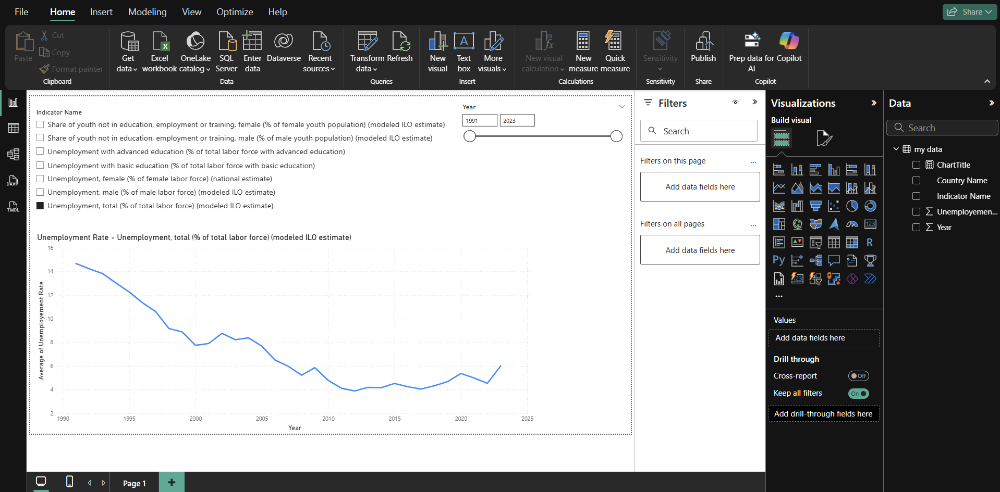
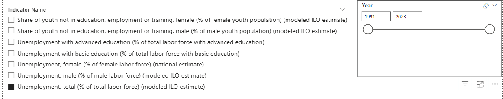

# 🇱🇰 Sri Lanka Unemployment & Youth NEET Dashboard (2010–2024)

📊 A Power BI project visualizing unemployment trends and youth exclusion indicators in Sri Lanka using World Bank data.

This dashboard allows users to explore changes in unemployment (by gender and education level) and the **NEET** (Not in Education, Employment, or Training) rate among youth from **2010 to 2024**.

---

## 🖼️ Dashboard Preview

### 🔹 Full Dashboard View

### 🔹 Dynamic Slicer Filtering by Indicator and by year

---

## 📌 Key Features

- 📈 **Line Charts** for each indicator over time
- 🎛️ **Slicers**:
  - Year range slider (zoom into specific periods)
  - Indicator selector (choose from 7 unemployment/NEET metrics)
- 🧠 Gender-specific and education-level unemployment insights
- 🗂️ All data filtered for **Sri Lanka** only

---

## 📂 Indicators Visualized

1. **Unemployment, female** (% of female labor force)
2. **Unemployment, male** (% of male labor force)
3. **Unemployment, total** (% of total labor force)
4. **Unemployment with advanced education**
5. **Unemployment with basic education**
6. **NEET, female** (% of female youth population)
7. **NEET, male** (% of male youth population)

---

## 🔧 How It Works

- **Data Source**: World Bank Open Data (CSV files)
- **Data Modeling**:
  - Combined all indicators into one table
  - Extracted indicator names from filenames
- **Visual Tools**:
  - Used slicers to allow switching between indicators
  - Added year range filter using a range slider
- **Designed in**: Power BI Desktop (.pbix)

---

## 📁 Files Included

| File | Description |
|------|-------------|
| `SriLanka_Unemployment_Dashboard.pbix` | Power BI dashboard file |
| `images/` folder | Screenshots of dashboard and visuals |
| `README.md` | This file |

---

## 🚀 How to Use

1. Download or clone this repo
2. Open `SriLanka_Unemployment_Dashboard.pbix` in Power BI Desktop
3. Interact with slicers to explore indicators over time

---

## 🙋‍♀️ Insights You Can Explore

- Is youth NEET rate increasing over the years?
- Do unemployment rates differ by gender?
- How does education level affect unemployment?

---

## 🛠️ Requirements

- [Power BI Desktop](https://powerbi.microsoft.com/en-us/desktop/)

---

## 🤝 License

This project is for educational and visualization purposes. Data © World Bank.

---

